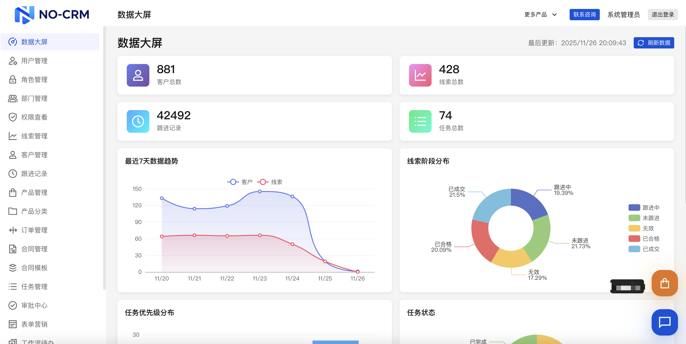

<div align="center">



# 🚀 FlowCRM

**一款轻量级、开箱即用的现代化 CRM 系统**

[简体中文](README.md) | [English](README_EN.md)

[](https://opensource.org/licenses/MIT)
[](https://nodejs.org/)
[](https://www.typescriptlang.org/)
[](https://nestjs.com/)
[](https://vuejs.org/)

[在线演示](#) | [快速开始](#快速开始) | [文档](#文档) | [反馈问题](https://github.com/MrXujiang/FlowCRM/issues)

</div>

---

## 🌟 其他优质项目

如果您对本项目感兴趣，也许您也会喜欢我们的其他优质项目：

### 1. [PxCharts 超级表格](https://github.com/MrXujiang/pxcharts)
一款功能强大的可视化表格组件，支持丰富的图表类型和数据展示。

### 2. [Jitword AI 协同文档](https://jitword.com)
智能AI协同文档系统，让团队协作更高效。

### 3. [灵语AI文档](https://mindlink.turntip.cn)
基于AI的智能文档管理平台，提升文档处理效率。

---

## 📖 简介

**FlowCRM** 是一款专为中小团队和个人销售打造的轻量级客户关系管理系统。采用前后端分离架构，使用 JSON 文件存储数据，**零数据库依赖**，让您可以在几分钟内快速部署并开始使用。

### ✨ 核心特性

- 🎯 **零配置启动** - 无需数据库，使用 JSON 文件存储，开箱即用
- 🚀 **现代化技术栈** - NestJS + Vue 3 + TypeScript，代码优雅且易维护
- 🎨 **精美UI设计** - 基于腾讯 TDesign 组件库，界面简洁专业
- 📊 **可视化数据大屏** - ECharts 驱动的实时数据展示，决策一目了然
- 🔐 **完善的权限控制** - JWT 认证，支持多角色权限管理
- 📱 **响应式设计** - 完美适配桌面端和移动端
- 🛠️ **易于扩展** - 模块化设计，可轻松添加新功能
- 🚢 **一键部署** - 提供自动化部署脚本，3分钟完成生产环境部署

### 🎯 适用场景

- 📈 小型创业团队的客户管理
- 💼 个人销售的线索跟踪
- 🏢 中小企业的销售流程管理
- 🎓 学习现代前后端开发的实战项目
- 🔧 快速搭建自定义 CRM 系统的基础模板

---

## 🏗️ 技术架构

### 技术栈

#### 后端
- **[NestJS](https://nestjs.com/)** - 企业级 Node.js 框架，提供完善的模块化架构
- **[TypeScript](https://www.typescriptlang.org/)** - 类型安全，降低错误率
- **[JWT](https://jwt.io/)** - 安全的用户认证机制
- **[Passport](http://www.passportjs.org/)** - 灵活的认证中间件
- **[class-validator](https://github.com/typestack/class-validator)** - 强大的数据验证

#### 前端
- **[Vue 3](https://vuejs.org/)** - 渐进式前端框架，Composition API
- **[Vite](https://vitejs.dev/)** - 极速开发构建工具
- **[TDesign Vue Next](https://tdesign.tencent.com/)** - 腾讯开源企业级 UI 组件库
- **[Pinia](https://pinia.vuejs.org/)** - Vue 官方推荐的状态管理
- **[Vue Router](https://router.vuejs.org/)** - 官方路由管理
- **[Axios](https://axios-http.com/)** - HTTP 请求库
- **[ECharts](https://echarts.apache.org/)** - 强大的数据可视化库

### 系统架构图

```
┌─────────────────────────────────────────────────────┐
│                  浏览器客户端                         │
│                  (Vue 3 + TDesign)                  │
└──────────────────┬──────────────────────────────────┘
                   │ HTTP/REST API
                   │ JWT Token
┌──────────────────┴──────────────────────────────────┐
│              NestJS 后端服务层                        │
│  ┌────────────┐  ┌────────────┐  ┌────────────┐    │
│  │ 认证模块    │  │ 客户模块    │  │ 线索模块    │    │
│  └────────────┘  └────────────┘  └────────────┘    │
│  ┌────────────┐  ┌────────────┐  ┌────────────┐    │
│  │ 跟进模块    │  │ 任务模块    │  │ 统计模块    │    │
│  └────────────┘  └────────────┘  └────────────┘    │
│                      │                               │
│            JsonStorageService                        │
└──────────────────────┬──────────────────────────────┘
                       │ File I/O
┌──────────────────────┴──────────────────────────────┐
│              JSON 文件存储层                          │
│  users.json | customers.json | leads.json           │
│  activities.json | tasks.json                       │
└──────────────────────────────────────────────────────┘
```

---

## 💡 核心功能

### 1️⃣ 用户认证与权限管理
- ✅ 用户注册与登录（JWT Token 认证）
- ✅ 角色权限控制（管理员/销售）
- ✅ 基于角色的数据访问控制

### 2️⃣ 客户管理
- ✅ 客户信息的增删改查
- ✅ 支持按姓名、公司、电话搜索
- ✅ 客户标签分类
- ✅ 客户来源追踪
- ✅ 完整的客户档案

### 3️⃣ 销售线索管理
- ✅ 线索创建与流转（未跟进 → 跟进中 → 已成交/无效）
- ✅ 线索阶段可视化看板
- ✅ 意向等级评估
- ✅ 线索与客户关联
- ✅ 快速筛选待跟进线索

### 4️⃣ 跟进记录管理
- ✅ 记录每次客户沟通（电话/邮件/会议/其他）
- ✅ 时间线方式展示跟进历史
- ✅ 支持添加跟进备注
- ✅ 下次跟进提醒设置

### 5️⃣ 任务与提醒
- ✅ 创建待办任务
- ✅ 任务优先级设置（高/中/低）
- ✅ 任务关联客户或线索
- ✅ 任务状态管理（待办/已完成）
- ✅ 到期任务提醒

### 6️⃣ 数据可视化大屏
- ✅ 实时统计客户、线索、任务数据
- ✅ 最近7天数据趋势图
- ✅ 线索阶段分布饼图
- ✅ 任务优先级柱状图
- ✅ 跟进方式雷达图
- ✅ 任务状态环形图

---

## 🚀 快速开始

### 环境要求

- **Node.js**: >= 16.0.0
- **npm**: >= 7.0.0（或使用 yarn/pnpm）

### 本地开发

#### 1. 克隆项目

```bash
git clone https://github.com/MrXujiang/FlowCRM.git
cd FlowCRM/source
```

#### 2. 安装依赖并启动后端

```bash
cd backend
npm install
npm run start:dev
```

后端服务将在 `http://localhost:3000` 启动

#### 3. 安装依赖并启动前端（新开终端）

```bash
cd ../frontend
npm install
npm run dev
```

前端服务将在 `http://localhost:5173` 启动

#### 4. 访问系统

在浏览器打开 `http://localhost:5173`

### 首次使用

1. 点击"注册"标签页创建账号
2. 登录后即可开始使用所有功能
3. 推荐先创建一个管理员账号

---

## 📁 项目结构

```
FlowCRM/
├── source/
│   ├── backend/                  # 后端服务
│   │   ├── src/
│   │   │   ├── auth/            # 认证模块 (JWT)
│   │   │   ├── customers/       # 客户管理模块
│   │   │   ├── leads/           # 线索管理模块
│   │   │   ├── activities/      # 跟进记录模块
│   │   │   ├── tasks/           # 任务管理模块
│   │   │   ├── statistics/      # 数据统计模块
│   │   │   ├── common/          # 公共服务 (JSON存储)
│   │   │   ├── app.module.ts    # 应用主模块
│   │   │   └── main.ts          # 应用入口
│   │   └── package.json
│   │
│   ├── frontend/                 # 前端应用
│   │   ├── src/
│   │   │   ├── api/             # API 接口层
│   │   │   ├── views/           # 页面组件
│   │   │   │   ├── Login.vue       # 登录页
│   │   │   │   ├── Dashboard.vue   # 数据大屏
│   │   │   │   ├── Customers.vue   # 客户管理
│   │   │   │   ├── Leads.vue       # 线索管理
│   │   │   │   ├── Activities.vue  # 跟进记录
│   │   │   │   └── Tasks.vue       # 任务管理
│   │   │   ├── layouts/         # 布局组件
│   │   │   ├── stores/          # Pinia 状态管理
│   │   │   ├── router/          # Vue Router 路由
│   │   │   └── main.ts          # 应用入口
│   │   └── package.json
│   │
│   ├── data/                     # 数据存储（运行时自动生成）
│   │   ├── users.json           # 用户数据
│   │   ├── customers.json       # 客户数据
│   │   ├── leads.json           # 线索数据
│   │   ├── activities.json      # 跟进记录
│   │   └── tasks.json           # 任务数据
│   │
│   ├── docs/                     # 开发文档
│   │   ├── 01-项目概览.md
│   │   ├── 02-后端开发指南.md
│   │   ├── 03-前端开发指南.md
│   │   ├── 04-数据大屏开发.md
│   │   └── 05-常见问题FAQ.md
│   │
│   ├── deploy/                   # 部署脚本和配置
│   │   ├── deploy.sh            # 自动化部署脚本
│   │   ├── check.sh             # 环境检查脚本
│   │   ├── nginx.conf           # Nginx 配置
│   │   ├── DEPLOY.md            # 完整部署文档
│   │   └── QUICKSTART.md        # 快速部署指南
│   │
│   └── prd.md                    # 产品需求文档
│
└── README.md                     # 本文件
```

---

## 🚢 生产环境部署

### 快速部署（3分钟）

FlowCRM 提供了自动化部署脚本，可以快速部署到任何 Linux 服务器。

#### 1. 修改配置

编辑 `source/deploy/nginx.conf` 第 2 行：
```nginx
server_name your-domain.com;  # 改为你的域名或IP
```

#### 2. 执行部署

```bash
cd source/deploy
./check.sh                               # 检查环境
./deploy.sh root@your-server-ip          # 开始部署
```

#### 3. 访问系统

```
http://your-server-ip
```

详细部署文档：[source/deploy/QUICKSTART.md](source/deploy/QUICKSTART.md)

---

## 🎯 技术亮点

### 1. 零数据库依赖的 JSON 存储方案

采用自研的 `JsonStorageService` 作为数据持久层，实现了完整的 CRUD 操作：

```typescript
// 核心特性
- 自动创建数据文件和目录
- 支持泛型类型约束
- 提供分页查询功能
- 线程安全的读写操作
- 易于备份和迁移
```

**优势：**
- ✅ 无需安装配置数据库
- ✅ 数据文件直接可读可编辑
- ✅ 天然支持版本控制
- ✅ 轻量级，适合中小规模数据

### 2. 模块化的 NestJS 架构

每个业务模块独立封装，遵循单一职责原则：

```typescript
// 模块结构
Module (模块定义)
  ├── Controller (路由层)
  ├── Service (业务逻辑)
  └── DTO (数据传输对象)
```

**优势：**
- ✅ 代码高内聚低耦合
- ✅ 易于单元测试
- ✅ 便于功能扩展
- ✅ 团队协作友好

### 3. Vue 3 Composition API 最佳实践

全面使用 Composition API，代码更加优雅和可维护：

```typescript
// 组合式函数复用
- 统一的 API 接口层
- 响应式状态管理 (Pinia)
- 自定义 Hooks 复用逻辑
- TypeScript 类型约束
```

**优势：**
- ✅ 更好的逻辑复用
- ✅ 更清晰的代码组织
- ✅ 更好的 TypeScript 支持
- ✅ 更小的打包体积

### 4. 企业级 UI 组件库

基于腾讯 TDesign 构建，提供开箱即用的企业级组件：

```typescript
// 核心组件
- 表格组件（支持分页、搜索、排序）
- 表单组件（完整的验证机制）
- 对话框组件（统一的交互体验）
- 消息提示（友好的用户反馈）
```

**优势：**
- ✅ 设计规范统一
- ✅ 无障碍访问支持
- ✅ 主题定制能力
- ✅ 丰富的组件生态

### 5. 实时数据可视化

使用 ECharts 实现专业的数据大屏：

```typescript
// 图表类型
- 折线图：数据趋势分析
- 饼图/环形图：占比分析
- 柱状图：对比分析
- 雷达图：多维度评估
```

**特性：**
- ✅ 响应式图表自适应
- ✅ 丰富的动画效果
- ✅ 支持数据钻取
- ✅ 移动端完美适配

### 6. JWT 认证与权限控制

完整的用户认证和授权体系：

```typescript
// 安全机制
- JWT Token 无状态认证
- 路由级别的权限守卫
- 基于角色的访问控制 (RBAC)
- 密码加密存储 (bcrypt)
```

**优势：**
- ✅ 无需 Session 存储
- ✅ 支持分布式部署
- ✅ 细粒度权限控制
- ✅ 安全性高

---

## 📚 文档

### 开发文档

- [项目概览](source/docs/01-项目概览.md) - 了解项目整体架构
- [后端开发指南](source/docs/02-后端开发指南.md) - NestJS 开发详解
- [前端开发指南](source/docs/03-前端开发指南.md) - Vue 3 开发详解
- [数据大屏开发](source/docs/04-数据大屏开发.md) - ECharts 可视化
- [常见问题FAQ](source/docs/05-常见问题FAQ.md) - 疑难问题解答

### 部署文档

- [快速部署指南](source/deploy/QUICKSTART.md) - 3分钟快速部署
- [完整部署文档](source/deploy/DEPLOY.md) - 生产环境配置

### API 文档

启动后端服务后访问：`http://localhost:3000/api`

---

## 🛠️ 开发指南

### 添加新模块

1. 使用 NestJS CLI 生成模块：
```bash
cd source/backend/src
nest g module your-module
nest g controller your-module
nest g service your-module
```

2. 创建 DTO：
```bash
mkdir your-module/dto
touch your-module/dto/your-module.dto.ts
```

3. 在 `app.module.ts` 中注册模块

### 代码规范

- 使用 ESLint 和 Prettier 格式化代码
- 遵循 TypeScript 严格模式
- 使用有意义的变量名和函数名
- 添加必要的注释

### Git 提交规范

```
feat: 新功能
fix: 修复 bug
docs: 文档更新
style: 代码格式调整
refactor: 重构代码
test: 测试相关
chore: 构建/工具相关
```

---

## 🤝 贡献指南

欢迎所有形式的贡献！无论是报告 bug、提出新功能建议，还是提交代码。

### 如何贡献

1. Fork 本项目
2. 创建你的特性分支 (`git checkout -b feature/AmazingFeature`)
3. 提交你的改动 (`git commit -m 'Add some AmazingFeature'`)
4. 推送到分支 (`git push origin feature/AmazingFeature`)
5. 开启一个 Pull Request

### 开发规范

- 确保代码通过 ESLint 检查
- 为新功能添加测试用例
- 更新相关文档
- 保持代码风格一致

---

## 📝 更新日志

### v1.0.0 (2025-12)

- ✨ 初始版本发布
- ✅ 完整的客户管理功能
- ✅ 销售线索跟踪
- ✅ 跟进记录管理
- ✅ 任务提醒功能
- ✅ 数据可视化大屏
- ✅ 用户认证与权限管理
- ✅ 自动化部署脚本

---

## 📄 许可证

本项目采用 [MIT](LICENSE) 许可证。

---

## 🙏 致谢

感谢以下优秀的开源项目：

- [NestJS](https://nestjs.com/) - 渐进式 Node.js 框架
- [Vue.js](https://vuejs.org/) - 渐进式 JavaScript 框架
- [TDesign](https://tdesign.tencent.com/) - 腾讯企业级设计体系
- [ECharts](https://echarts.apache.org/) - Apache 数据可视化库
- [TypeScript](https://www.typescriptlang.org/) - JavaScript 超集

---

## 📮 联系我们

- 提交 Issue: [GitHub Issues](https://github.com/MrXujiang/FlowCRM/issues)
- 邮件: xujiang156@qq.com
- 官网: http://no-crm.flowmix.cn

---

## ⭐ Star History

如果这个项目对你有帮助，请给我们一个 Star ⭐️

[](https://star-history.com/#MrXujiang/FlowCRM&Date)

---

<div align="center">

Made with ❤️ by FlowCRM Team

[⬆ 回到顶部](#-flowcrm)

</div>


